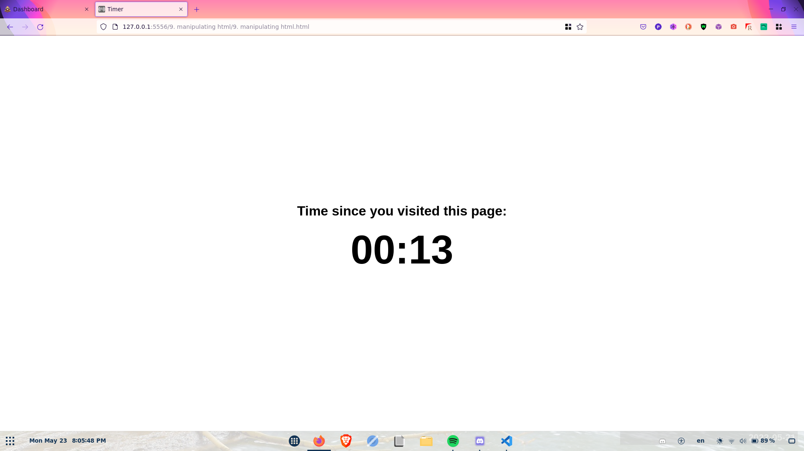

# Manipulating HTML Continued...

Now for a bit more fun!

Check out the corresponding html file with the same name as this file. When you open it in your browser, you should see something that looks like this:



Take a while to familiarise yourself with the file.

...

Now let's dive into the javascript in there.

You'll see in the script that we are obtaining a reference to a html element with the id of `timer`.

```javascript
let timer = document.getElementById("timer");
```

This is the timer you see in the middle of the screen of the website.

We also initialise a variable called `time` to store the time since the user visited the site, in seconds.

```javascript
let time = 0;
```

After that, we call a *built-in* javascript function: `setInterval`.

```javascript
setInterval(() => {
    //...
}, 1000);
```

There are several new features going on in here.

1. We are introducing the concept of passing functions like *variables*.

2. We are also introducing the concept of *arrow functions*, or *lambda functions*.

Earlier on, [we covered different data types in javascript](../3.%20syntax.md). Not all the data types were listed. There's one more, and that's functions.

Take this for example:

```javascript
let x = function name(params) {
    //...
}
```

The value of `x` is a function, and we can now use `x` just like we would with any other function!

```javascript
x("Some stuff");
```

Storing functions in variables and using them as arguments for other functions are important parts of javascript. A lot of things we will do later on will use this.

Of course, there's a bit of redundancy when we're creating these functions.

Notice how when we created the function for the `x` variable, we named the function `name`. Normally, we do this so we can invoke the function using its name later on. However, in this case, we can only access the function through `x`, so there's no point naming it. It also becomes a bit of a pain having to constantly write `function`, so this is where we get *lambda functions*.

Lambda functions are a short-hand for creating *anonymous* functions. Anonymous functions have no names and are made purely for assigning to variables or to be passed into other functions.

Rewriting the above example using lambda functions, we get this:

```javascript
x = (params) => {
    //...
}
```

So, going back to the `setInterval` code, we can see that we're passing in a lambda function to the `setInterval` function as a parameter.

Now that we know the semantics of that code, let's learn what it actually does.

`setInterval` is used for running a bit of code every few milliseconds. We do this by passing in a function, the code to run, and the interval, in milliseconds. So with the above `setInterval` function, we're running this bit of code every 1000 milliseconds, or every second:

```js
() => {
    time++;

    timer.innerText = `${Math.floor(time / 60).toString().padStart(2, "0")}:${(time % 60).toString().padStart(2, "0")}`;
}
```

What this code does is fairly straightforward. We increase the `time` variable by one (remember, this represents how many seconds it has been since the user has visited the website) and then update the `innerText` of our timer element to reflect the time.

There's a little bit of math involved in converting pure seconds (what we store) to minutes *and* seconds (what we show).

We also use *string interpolation*, a fancy way of saying we embed bits of code in text. In javascript, you achieve string interpolation by using a pair of backticks (\`\`). Any text inside these is displayed as it normally would be. However, we can also embed code by using `${}`. Any code between the `{}` is run, and its result is converted to a string and inserted in. It's a handy little feature to minimise the amount of code you have to write.

## Extension
See if you can get the `title` element:

```html
<title>Timer</title>
```

to update to represent the time on the timer as well.


